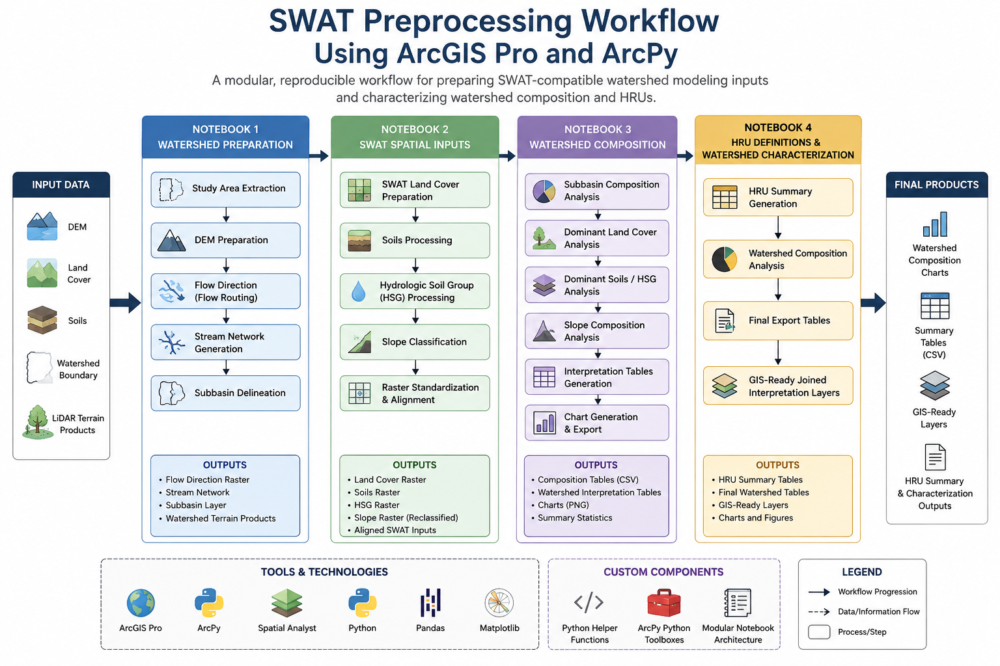
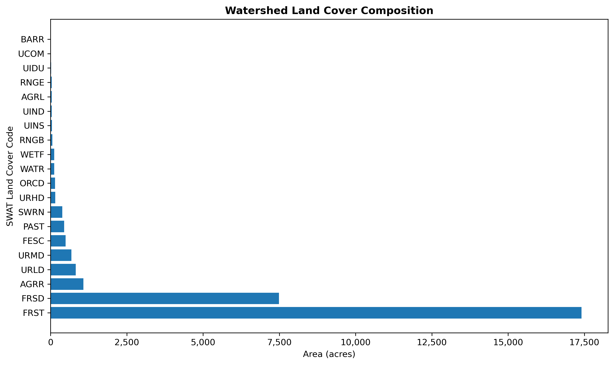
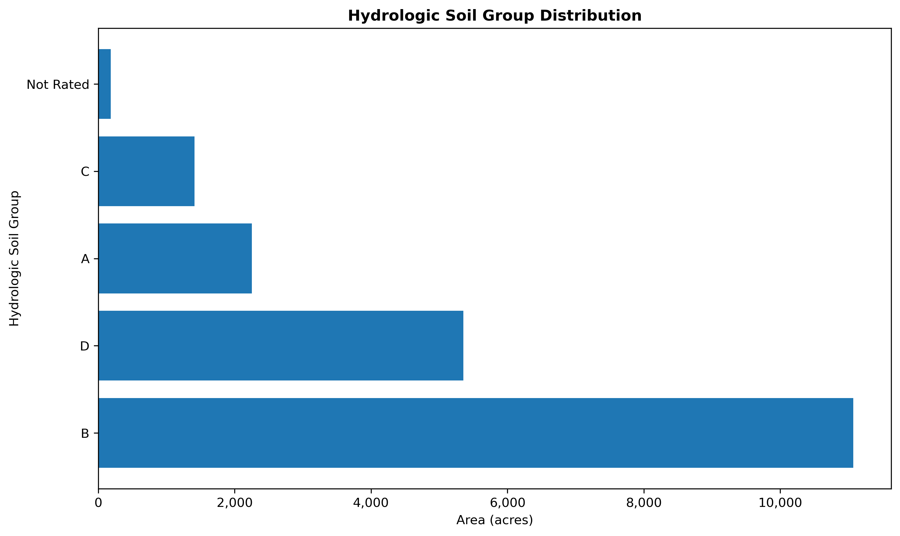
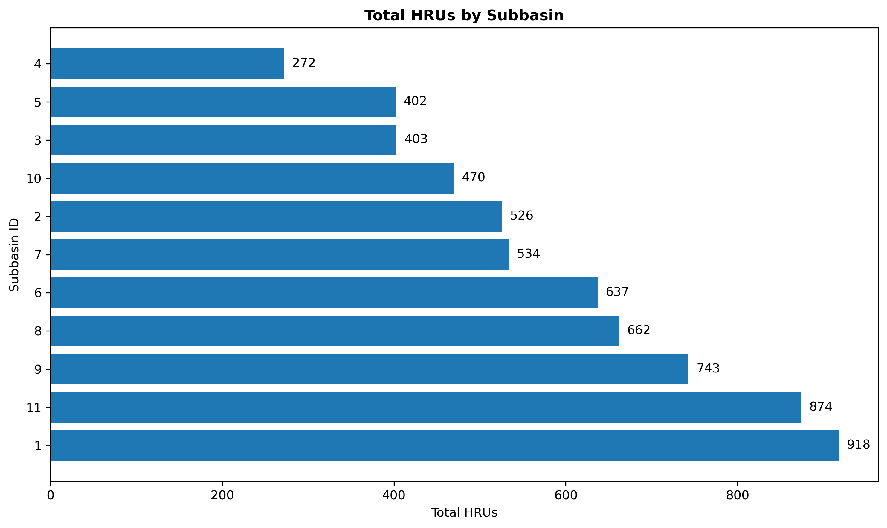

# SWAT Preprocessing Workflow Using ArcGIS Pro and ArcPy

This repository contains a modular ArcGIS Pro and ArcPy workflow for preparing SWAT-compatible watershed modeling inputs, including hydrologic preprocessing, terrain analysis, land cover and soils standardization, watershed characterization, and hydrologic response unit (HRU) development.

The workflow was developed to replicate and modernize portions of traditional ArcSWAT preprocessing workflows using reusable Python scripting tools, custom ArcPy toolboxes, and reproducible notebook-based GIS analysis.

---

## Project Purpose

This workflow was developed as part of a broader effort to modernize and document reproducible GIS preprocessing workflows for watershed modeling and hydrologic analysis using ArcGIS Pro and Python-based automation.

The primary goals of this project were to:

- modernize a legacy ArcMap SWAT preprocessing workflow
- transition manual GIS operations into reproducible Python notebooks
- automate repetitive hydrologic preprocessing tasks
- improve workflow transparency and quality assurance (QA)
- generate clean SWAT-ready spatial inputs
- document preprocessing logic in a reproducible and modular format

---

## Workflow Diagram



---

## Workflow Overview

The workflow is organized into four sequential notebooks:

### Notebook 1 - Watershed Preparation

- study area extraction
- DEM preparation
- flow routing
- stream network generation
- subbasin delineation

### Notebook 2 - SWAT Spatial Inputs

- SWAT land cover preparation
- soils and hydrologic soil group processing
- slope classification
- raster standardization and alignment

### Notebook 3 - Watershed Composition

- subbasin composition summaries
- dominant land cover, soils, and slope analysis
- watershed interpretation tables
- chart generation and export workflows

### Notebook 4 - HRU Definitions and Watershed Characterization

- HRU summary generation
- watershed composition analysis
- final export tables
- GIS-ready joined interpretation layers

---

## Project Outputs

This workflow produces watershed characterization outputs used to evaluate land cover, soils, slope, and watershed composition for SWAT-style watershed modeling.

### Watershed Composition





### Watershed Characterization



Additional charts, tables, and maps are available throughout the repository.

---

## Repository Structure

```text
SWAT_Preprocessing_Workflow/
├── Charts/
├── Maps/
├── Notebooks/
├── Python_Helpers/
├── Tables/
└── Toolbox_Reference/
```

---

## Tools and Libraries

### GIS Software

- ArcGIS Pro
- ArcPy
- Spatial Analyst

### Python Libraries

- Python
- Pandas
- Matplotlib

### Custom Workflow Components

- reusable Python helper functions
- custom ArcPy Python toolboxes
- modular notebook workflow architecture

---

## Data Requirements

Large GIS datasets and proprietary source data are not included in this repository.

Users must provide their own:

- DEM datasets
- land cover datasets
- soils datasets
- watershed boundary datasets
- LiDAR-derived terrain products

Notebook paths have been generalized for public release.

---

## Related Work

This repository focuses on GIS preprocessing and watershed characterization for SWAT modeling.

A companion repository documents SWAT model calibration, validation, uncertainty analysis, and hydrologic interpretation using SWAT and SWAT-CUP.

---

## Author

Alexandra DeRosa

Master of Environmental Science and Management  
University of Rhode Island

Graduate Certificate in Hydrology  
Graduate Certificate in Geographic Information Systems and Remote Sensing